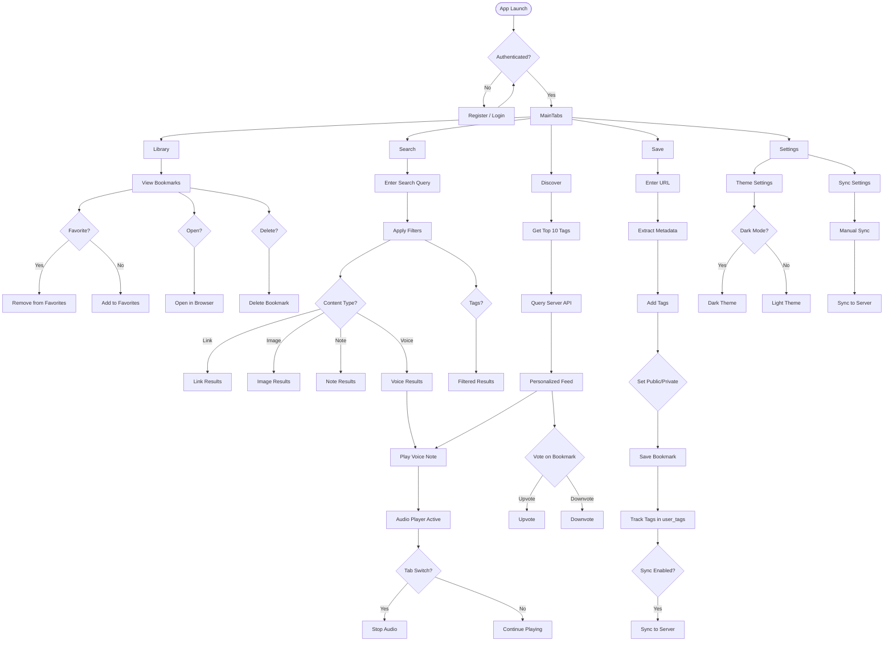
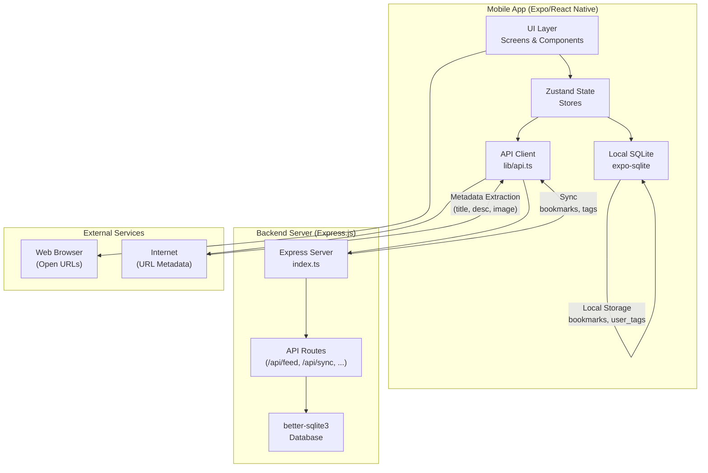
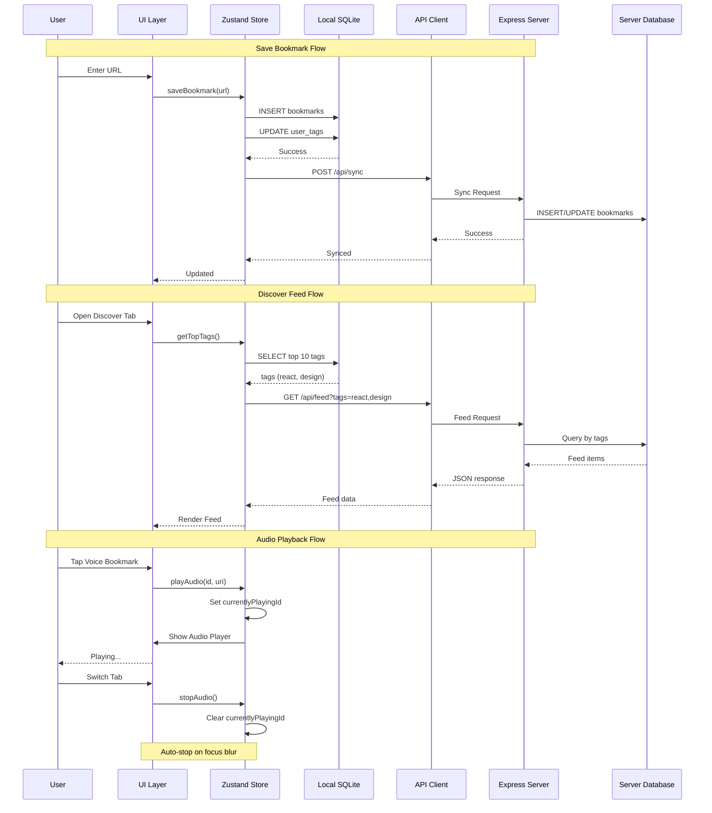

# Memora - Project Documentation

## App Flow Diagram



## System Architecture Diagram





## Overview

Memora is a mobile bookmark management app built with Expo (React Native). It allows users to save, organize, and discover web bookmarks with tags. The app features a personalized discovery feed that recommends bookmarks based on user's saved interests.

## Tech Stack

| Category | Technology |
|----------|-------------|
| Framework | Expo SDK 54 + React Native 0.81 |
| Navigation | expo-router v6 |
| State Management | Zustand |
| Database | expo-sqlite (local) + better-sqlite3 (server) |
| Audio | expo-av |
| UI Components | React Native + react-native-reanimated |
| Backend | Express.js (Node.js) |

## Project Structure

```
memora/
├── app/                    # expo-router screens
│   ├── (tabs)/            # Tab navigation screens
│   │   ├── index.tsx      # Library (saved bookmarks)
│   │   ├── search.tsx     # Search bookmarks
│   │   ├── save.tsx       # Save new bookmark
│   │   ├── discover.tsx   # Discover community bookmarks
│   │   ├── settings.tsx   # App settings
│   │   └── _layout.tsx    # Tab layout
│   └── _layout.tsx        # Root layout
├── components/            # Reusable UI components
│   ├── GridBookmarkCard.tsx
│   ├── BookmarkCard.tsx   # (dead code - unused)
│   ├── AudioPlayerModal.tsx
│   └── ...
├── stores/                # Zustand state stores
│   ├── useThemeStore.ts  # Theme (colors, spacing)
│   ├── useBookmarkStore.ts # Bookmarks CRUD
│   ├── useAuthStore.ts    # Authentication
│   └── useAudioStore.ts   # Audio playback
├── lib/
│   ├── db.ts             # Local SQLite database
│   └── api.ts            # API client for server
├── server/               # Express backend
│   └── index.ts          # API endpoints
└── constants/
    └── theme.ts          # Theme constants
```

## Features

### 1. Bookmark Management
- Save URLs with automatic metadata extraction (title, description, image)
- Add custom tags to bookmarks
- Mark bookmarks as public/private
- Favorite/bookmark bookmarks
- Delete bookmarks

### 2. Search & Filter
- Full-text search across bookmarks
- Filter by content type (link, image, note, voice)
- Filter by tags

### 3. Audio Playback
- Play voice notes directly in the app
- Centralized audio state (only one plays at a time)
- Auto-stop when switching tabs

### 4. Discover Feed (Server-Based)
- Shows community bookmarks from other users
- Personalized recommendations based on user's top saved tags
- Tags tracked locally and synced to server

### 5. Theme Support
- Dark/Light mode
- Customizable colors, spacing, typography

## Database Schema

### Local Database (expo-sqlite)

**bookmarks table:**
```sql
CREATE TABLE bookmarks (
  id TEXT PRIMARY KEY,
  url TEXT NOT NULL,
  title TEXT,
  description TEXT,
  image_url TEXT,
  domain TEXT,
  tags TEXT DEFAULT '[]',
  is_public INTEGER DEFAULT 0,
  is_favorite INTEGER DEFAULT 0,
  local_path TEXT,
  created_at INTEGER,
  updated_at INTEGER,
  synced_at INTEGER,
  is_deleted INTEGER DEFAULT 0
);
```

**user_tags table:**
```sql
CREATE TABLE user_tags (
  tag TEXT PRIMARY KEY,
  count INTEGER DEFAULT 0,
  last_used INTEGER
);
```

**sync_queue table:**
```sql
CREATE TABLE sync_queue (
  id TEXT PRIMARY KEY,
  payload TEXT NOT NULL,
  operation TEXT NOT NULL,
  status TEXT DEFAULT 'pending',
  retry_count INTEGER DEFAULT 0,
  created_at INTEGER
);
```

### Server Database (better-sqlite3)

**bookmarks table:**
```sql
CREATE TABLE bookmarks (
  id TEXT PRIMARY KEY,
  url TEXT NOT NULL,
  title TEXT,
  description TEXT,
  tags TEXT DEFAULT '[]',
  save_count INTEGER DEFAULT 1,
  created_at INTEGER NOT NULL
);
```

**global_tags table:**
```sql
CREATE TABLE global_tags (
  tag TEXT PRIMARY KEY,
  count INTEGER DEFAULT 0
);
```

## API Endpoints

### Server (Express)

| Endpoint | Method | Description |
|----------|--------|-------------|
| `/api/feed` | GET | Get community feed (supports `?tags=react,design&limit=50`) |
| `/api/sync` | POST | Sync bookmarks from app |
| `/api/vote` | POST | Vote for a bookmark |
| `/api/preview` | GET | Get URL metadata (`?url=...`) |
| `/api/auth/register` | POST | Register user |
| `/api/auth/check-username` | GET | Check username availability |

## State Management (Zustand)

### useAudioStore
```typescript
interface AudioState {
  currentlyPlayingId: string | null;
  isPlaying: boolean;
  play: (bookmarkId: string, audioUri: string) => Promise<void>;
  pause: () => Promise<void>;
  resume: () => Promise<void>;
  stop: () => Promise<void>;
}
```

### useBookmarkStore
- `bookmarks`: All saved bookmarks
- `loadBookmarks()`: Fetch from local DB
- `addBookmark()`: Save new bookmark
- `removeBookmark()`: Delete bookmark
- `searchBookmarks()`: Full-text search

## Key Implementation Details

### 1. Audio Auto-Stop on Tab Switch
Uses `useFocusEffect` to stop audio when leaving a screen:
```typescript
useFocusEffect(
  useCallback(() => {
    return () => stop(); // Cleanup on unmount
  }, [stop])
);
```

### 2. Discover Feed Recommendation
1. Get user's top 10 tags from local `user_tags` table
2. Send tags to server `/api/feed?tags=react,design`
3. Server filters bookmarks by those tags
4. Returns trending + recent bookmarks

### 3. Tag Tracking
- When bookmark saved locally → tags added to `user_tags` table
- When syncing to server → server updates `global_tags` table
- Discover feed uses local tags to query server

## Running the Project

### Development
```bash
# Terminal 1 - Start server
cd memora/server
npm run server

# Terminal 2 - Start app
cd memora
npx expo start
```

### Build
```bash
npx expo run:android
# or
npx expo run:ios
```

## Known Issues / Dead Code

- `components/BookmarkCard.tsx` - Unused component (not imported anywhere)
- `components/AudioPlayerModal.tsx` - Originally had local audio state, now uses centralized store
- `components/BookmarkOptionsModal.tsx` - Not used
- `components/ImageViewerModal.tsx` - Not used
- `components/NoteReaderModal.tsx` - Not used
- `components/EmptyState.tsx` - Used in some places

## Future Improvements

1. **Offline Discover Feed**: Cache server feed locally for offline use
2. **Tag Suggestions**: Auto-suggest tags when saving bookmarks
3. **Share Extension**: Save bookmarks from other apps
4. **Export/Import**: Backup and restore bookmarks
5. **PWA Support**: Web version of the app